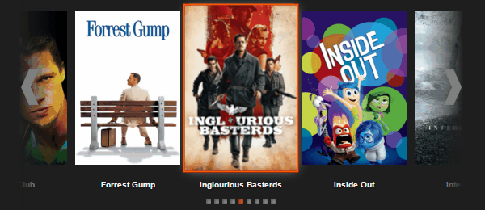

# SliderTV
SliderTV is an easy-to-use jQuery slider plugin optimized for Smart TV apps.
Use jQuery SliderTV for controlling any HTML based content in horizontal or vertical order in a carousel-like fashion.

### Features
- Slide any HTML content horizontally or vertically in your Smart TV application.
- Support for interactive navigational arrows, compatible with LG Magic Control.
- Automatic focusing.
- Support for multiple carousels on the same View.
- Support for bullets.
- Jump to any HTML content using previous/next or by an identifier.

---

### Great! So how do I use it?
- Install with [Bower](http://bower.io) `bower install jquery-slidertv`.
- Add a reference sliderTV.js in your html `<script src="sliderTV.min.js"></script>`.
- Add your HTML as shown in the [examples](examples).
- Initialize SliderTV `$('#slider').sliderTV();`
- Trigger events on the Slider to start the action!
- Further information can be found in [docs](docs/sliderTV.md).

### How do I run the examples?
- First install all dependencies folder using:: `npm install`, `npm bower`.
- Now runs your local server and open the examples: `gulp connect`, `gulp examples`.

---
### Markup
SliderTV plugin needs the following HTML markup:

- DIVs with class `sliderTV__item` are wrappers for your items in the carousel. You can add here, for example, some movie covers with their titles. Markup required.
- DIVs with class `sliderTV__prev` and `sliderTV__next` are wrapper for your navigational arrows. Markup optional.

```
<div id="slider" class="sliderTV">
    <div class="sliderTV__item">
        <!-- item html -->
    </div>
    <div class="sliderTV__item">
        <!-- item html -->
    </div>
    <div class="sliderTV__item">
        <!-- item html -->
    </div>
    <div class="sliderTV__prev">
        <!-- optional navigation element for previous -->
    </div>
    <div class="sliderTV__next">
        <!-- optional navigation element for next -->
    </div>
</div>
```
---

### Customization
You can customize the defaults for the entire plugin or ad hoc for each instance of the slider.
#### Global defaults

##### Animation direction
The direction of the Slider animation. By default the Slider has a horizontal carousel style. You can enable vertical carousel using this option.
Available values are `true` or `false`.
Example:

`$.fn.slider.defaults.animation.isVertical = true;`

##### Animation speed
The speed for the Slider animation. Default is `wing`.

`$.fn.slider.defaults.animation.duration = 400;`

##### Animation easing
Easing equation for Slider animation.
Available values are  `swing` and `linear` (from JQuery).
Example:

`$.fn.slider.defaults.animation.easing = 'swing';`

##### Bullets
Bullets are "indicator", useful for showing how many items are in your slider and which one is currently focused.
They are created by default but you can decide to having them or not using the following option.
Available values are `true` or `false`.
Example:

`$.fn.slider.defaults.bullets.canShow = true;`

##### Navigation
Navigational elements  indicate if a "next" or "previous" item in the slider exists for the currently focused item.
In order to enable these elements you need to add your own HTML markup and just add classes `slider__next` and `slider__prev`.
The following example shows you a typical HTML for a Slider plus Navigational elements:

#### Per instance
Initialize your instance passing an object with properties as options above.
The defaults will be applied per instance.
Example:

```
    $('#sliderTV').sliderTV({
        animation: {
            duration: 50,
            easing: 'linear',
            isVertical: true
        },
        bullets: {
            canShow: false,
        }
    });
```

## Examples

#### Horizontal carousel


#### Vertical carousel

